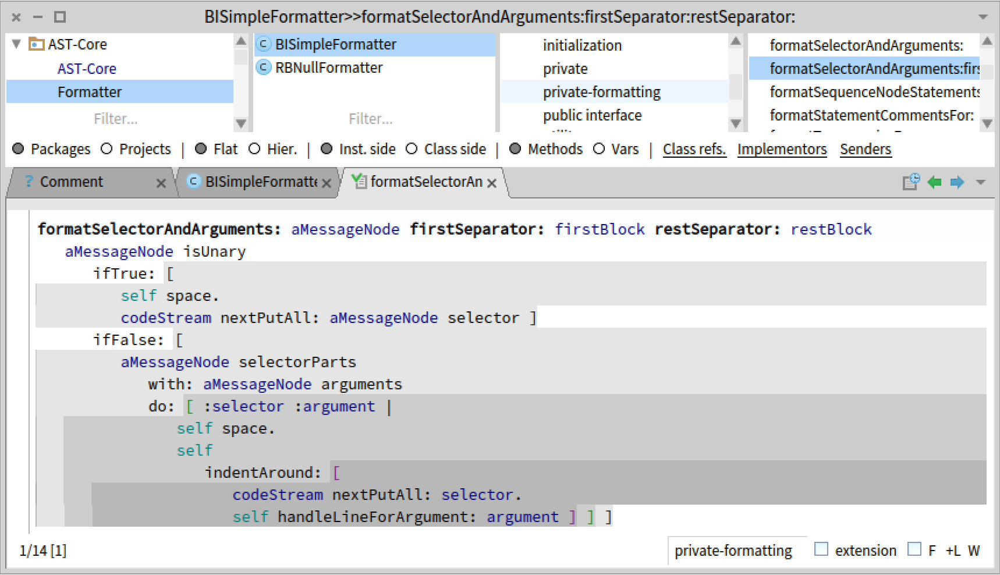
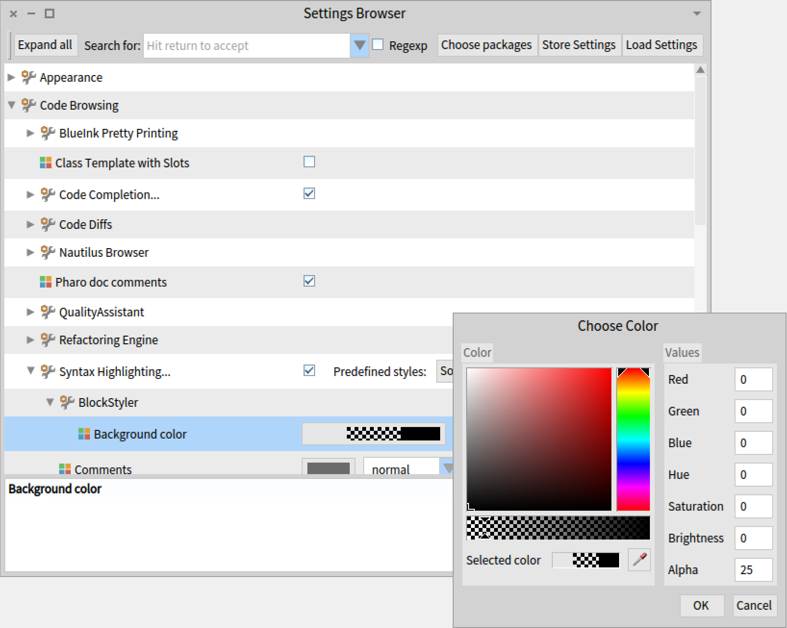

# BlockStyler

Highlights blocks to make them stand out more and detect nesting levels more easily.

## Highlight



## Installation

Install through the Catalog by searching for BlockStyler or install with Metacello from GitHub:

```smalltalk
Metacello new
	baseline: 'BlockStyler';
	repository: 'github://maenu/BlockStyler/repository';
	load
```

## Settings

You can set the highlight color with alpha using the settings browser under `Code Browsing > Syntax Highlighting > BlockStyler`.
Themes are supported.


